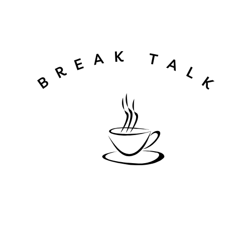

# BreakTalk Skills: a public Claude skills library for Chief of Staff work, empirical PhD research, and writing

I work two jobs that look unrelated and are not. I am Chief of Staff at a US B2B consulting firm, and I am a PhD candidate in Economics at Korea University. Both jobs are the same discipline applied to different material: take something complicated and messy, structure it, attach evidence to every claim, and hand someone a document they can act on.

Over the past two years I built Claude skills to enforce that discipline in my own work, first for the consulting side, then for the research pipeline. This repository is the public, generalized version of that library: 76 skills across four tracks. Nothing here contains employer or client material; these are the methods, rebuilt from scratch to be usable by anyone.

I write about how this works in practice at [BreakTalk](https://breaktalk.substack.com).

## What is a skill

A skill is a folder with a `SKILL.md` file: instructions Claude loads when a matching task appears. Skills do not make Claude know more. They make Claude work to a standard, in a repeatable way, so the tenth market analysis follows the same method as the first. The format is documented in [Anthropic's skills documentation](https://docs.claude.com).

Several skills here use connected tools when they are available (ZoomInfo for account and contact data, Consensus for academic search, a CRM for pipeline data) and fall back to web research when they are not. None of them require a paid connector to work.

## Installing

**Claude.ai**: Settings, Capabilities, Skills, then upload a skill folder as a zip. The `releases` page carries each skill zipped individually.

**Claude Code**: copy a skill folder into `.claude/skills/` in your project, or into `~/.claude/skills/` for all projects.

Each skill is self-contained. Install only the ones that match your work.

## Two audiences

The library is built for two kinds of reader, and it is worth starting from the one you are.

**If you run the operating layer of a company**, start with the [Chief of Staff track](chief-of-staff/README.md). Thirty skills for the memo, the model, the deck, the cadence, and the commercial document, extended by the [commercial and data track](commercial-and-data/README.md) into revenue and client analytics, content quality, account re-engagement, sales coaching, and commercial paperwork. Forty-six skills in total.

**If you are doing empirical research**, start with the [PhD research track](phd-research/README.md). Twenty-four skills covering the pipeline from a vague topic to a replication package, with the standard a referee applies built into each stage.

**Either way**, the [brand and writing track](brand-and-writing/README.md) applies. A board memo and a discussion section fail in the same ways, and the six skills there address both, including the one that teaches you to write your own.

I use both halves in the same week, which is the reason they sit in one repository. The discipline is identical: structure the mess, attach evidence to every claim, hand someone a document they can act on.

## Start here

Reading seventy-six files is not the way in. Take one, run it on work you are already doing this week, and see whether the output is better than what you would have got without it.

| If you are | Start with | Because |
| --- | --- | --- |
| A Chief of Staff or operator | [consultant-toolkit](chief-of-staff/consultant-toolkit/SKILL.md) | It is the thinking layer the rest of the track sits on: decision-shaped questions, answer-first memos, every claim quantified |
| Running a sales or revenue function | [pipeline-deep-dive](chief-of-staff/pipeline-deep-dive/SKILL.md) | It turns a CRM export into coverage, conversion, velocity, concentration, and an action list with owners |
| A doctoral student starting a paper | [research-design](phd-research/research-design/SKILL.md) | It forces the one-page design, with hypotheses mapped to exhibits and a kill criterion, before any estimation |
| Writing up results you already have | [results-writing](phd-research/results-writing/SKILL.md) | Findings first, magnitudes translated, causal language calibrated to what the design supports |
| Handed a spreadsheet you did not build | [spreadsheet-analysis-workbook](commercial-and-data/spreadsheet-analysis-workbook/SKILL.md) | It is the sequence that stops you answering confidently from a column you have misunderstood |
| Wanting to write your own | [skill-builder](brand-and-writing/skill-builder/SKILL.md) | It is the method behind every file here, including how to phrase a description so the skill actually loads |

## The catalog

All 76 skills are built. Each row links to the skill.

### [Chief of Staff track (30)](chief-of-staff/README.md)

| # | Skill | What it enforces | Status |
| --- | --- | --- | --- |
| 1 | [consultant-toolkit](chief-of-staff/consultant-toolkit/SKILL.md) | Decision-shaped questions, structured problems, answer-first memos, quantified claims | built |
| 2 | [program-management](chief-of-staff/program-management/SKILL.md) | Single owners, dated milestones, honest status, decision logs, recovery of slipping programs | built |
| 3 | [market-research](chief-of-staff/market-research/SKILL.md) | Two-method market sizing, sourced competitor tables, research framed by the decision it feeds | built |
| 4 | [ideation-deck](chief-of-staff/ideation-deck/SKILL.md) | Raw idea to decision-ready concept deck: options, evidence, pilot metric, kill criterion, ask | built |
| 5 | [tailored-client-deck](chief-of-staff/tailored-client-deck/SKILL.md) | Client-specific decks rebuilt around one account, with correct logo and co-branding handling | built |
| 6 | [outreach-email](chief-of-staff/outreach-email/SKILL.md) | Research-first B2B outreach and follow-ups, ZoomInfo-grounded when connected | built |
| 7 | [external-insights](chief-of-staff/external-insights/SKILL.md) | Outside-in intelligence briefs, verified and dated, before any meeting or pitch | built |
| 8 | [pipeline-deep-dive](chief-of-staff/pipeline-deep-dive/SKILL.md) | Coverage, conversion, velocity, concentration, hygiene, three-way forecast, action list | built |
| 9 | [executive-briefing](chief-of-staff/executive-briefing/SKILL.md) | One-page briefs for a leader walking into a meeting cold | built |
| 10 | [board-deck](chief-of-staff/board-deck/SKILL.md) | Board materials with headline titles, one idea per page, decisions requested | built |
| 11 | [investor-update](chief-of-staff/investor-update/SKILL.md) | Monthly and quarterly investor updates: metrics, wins, misses, asks | built |
| 12 | [weekly-status-update](chief-of-staff/weekly-status-update/SKILL.md) | Three-line workstream status and the exceptions-only leadership summary | built |
| 13 | [meeting-to-decisions](chief-of-staff/meeting-to-decisions/SKILL.md) | Notes or transcripts into decisions, owners, dates, and a circulated summary | built |
| 14 | [operating-cadence-design](chief-of-staff/operating-cadence-design/SKILL.md) | Designing the weekly, monthly, and quarterly rhythm of a company | built |
| 15 | [okr-planning](chief-of-staff/okr-planning/SKILL.md) | Objectives and key results that are measurable, owned, and few | built |
| 16 | [financial-model-builder](chief-of-staff/financial-model-builder/SKILL.md) | Driver-based financial models with stated assumptions and scenario toggles | built |
| 17 | [pricing-and-resourcing-model](chief-of-staff/pricing-and-resourcing-model/SKILL.md) | Engagement pricing, staffing, ramp, and margin models for services businesses | built |
| 18 | [revenue-forecast](chief-of-staff/revenue-forecast/SKILL.md) | Annual revenue forecast from pipeline, run-rate, and capacity, board-ready | built |
| 19 | [proposal-writer](chief-of-staff/proposal-writer/SKILL.md) | Client proposals structured by what the client needs to decide | built |
| 20 | [sow-and-scope](chief-of-staff/sow-and-scope/SKILL.md) | Statements of work with explicit scope, exclusions, assumptions, and acceptance | built |
| 21 | [hiring-scorecard-and-interview-kit](chief-of-staff/hiring-scorecard-and-interview-kit/SKILL.md) | Role scorecards, structured interview questions, and evaluation rubrics | built |
| 22 | [onboarding-plan](chief-of-staff/onboarding-plan/SKILL.md) | 30-60-90 day plans with owners, milestones, and check-ins | built |
| 23 | [process-documentation-sop](chief-of-staff/process-documentation-sop/SKILL.md) | Standard operating procedures that someone new can follow without asking | built |
| 24 | [vendor-evaluation](chief-of-staff/vendor-evaluation/SKILL.md) | Vendor comparison with total cost, risk, and negotiation points | built |
| 25 | [partnership-assessment](chief-of-staff/partnership-assessment/SKILL.md) | Strategic partnership evaluation: fit, economics, governance, exit | built |
| 26 | [competitive-battlecard](chief-of-staff/competitive-battlecard/SKILL.md) | Evidence-based battlecards: positioning, pricing, objections, traps | built |
| 27 | [customer-interview-synthesis](chief-of-staff/customer-interview-synthesis/SKILL.md) | Interview notes into themes, frequency, and roadmap implications | built |
| 28 | [event-and-offsite-planning](chief-of-staff/event-and-offsite-planning/SKILL.md) | Agendas, logistics, outcomes, and follow-up for events and leadership offsites | built |
| 29 | [ceo-communications](chief-of-staff/ceo-communications/SKILL.md) | Talking points, all-hands scripts, and internal announcements in the CEO's voice | built |
| 30 | [crisis-and-incident-comms](chief-of-staff/crisis-and-incident-comms/SKILL.md) | Stakeholder communication under pressure: what to say, to whom, when | built |

### [PhD research track (24)](phd-research/README.md)

| # | Skill | What it enforces | Status |
| --- | --- | --- | --- |
| 31 | [research-design](phd-research/research-design/SKILL.md) | A written one-page design before estimation: question, hypotheses, identification, kill criteria | built |
| 32 | [literature-verification](phd-research/literature-verification/SKILL.md) | No citation enters a draft until verified; reviews built from an evidence matrix | built |
| 33 | [results-writing](phd-research/results-writing/SKILL.md) | Findings first, magnitudes translated, causal language calibrated, honest nulls | built |
| 34 | [theoretical-framework-review](phd-research/theoretical-framework-review/SKILL.md) | Referencial teórico built or diagnosed mechanism by mechanism, Consensus-grounded when connected | built |
| 35 | [research-question-ideation](phd-research/research-question-ideation/SKILL.md) | From topic to candidate questions with novelty check and feasibility triage | built |
| 36 | [data-profiling-and-cleaning](phd-research/data-profiling-and-cleaning/SKILL.md) | Profiling a research dataset: missingness, outliers, codebook checks, panel coherence | built |
| 37 | [stata-project-scaffold](phd-research/stata-project-scaffold/SKILL.md) | Numbered do-file skeleton from setup to first regressions | built |
| 38 | [econometric-model-writer](phd-research/econometric-model-writer/SKILL.md) | The empirical strategy section: equation, terms, assumptions, threats, clustering | built |
| 39 | [identification-defense](phd-research/identification-defense/SKILL.md) | Defending DiD, IV, RDD, and matching designs to a committee or referee | built |
| 40 | [descriptive-statistics-tables](phd-research/descriptive-statistics-tables/SKILL.md) | Table 1 and balance tables that are honest and journal-ready | built |
| 41 | [academic-figures-monochrome](phd-research/academic-figures-monochrome/SKILL.md) | Print-safe figures with series separated by pattern and marker, legend outside the plot | built |
| 42 | [academic-tables-booktabs](phd-research/academic-tables-booktabs/SKILL.md) | Regression and summary tables with three rules and no vertical lines | built |
| 43 | [abstract-and-title](phd-research/abstract-and-title/SKILL.md) | Abstracts traceable to results, titles that state the finding, keywords and JEL codes | built |
| 44 | [introduction-writer](phd-research/introduction-writer/SKILL.md) | The five moves: problem, gap, what the paper does, what it finds, contribution | built |
| 45 | [data-section-writer](phd-research/data-section-writer/SKILL.md) | Sources, sample construction with counts, variable definitions, availability statement | built |
| 46 | [discussion-and-conclusion](phd-research/discussion-and-conclusion/SKILL.md) | Restating at the level of the question, mechanisms, limitations, sized implications | built |
| 47 | [references-and-bibliography](phd-research/references-and-bibliography/SKILL.md) | Style conversion (APA, Chicago, ABNT, house styles), BibTeX hygiene, DOI checks | built |
| 48 | [journal-targeting](phd-research/journal-targeting/SKILL.md) | Scope fit, indexing checks, predatory screening, a ranked submission ladder | built |
| 49 | [peer-review-simulator](phd-research/peer-review-simulator/SKILL.md) | Adversarial pre-submission review from methodologist, field expert, and editor | built |
| 50 | [response-to-reviewers](phd-research/response-to-reviewers/SKILL.md) | Point-by-point responses and revision plans for a revise-and-resubmit | built |
| 51 | [conference-presentation-deck](phd-research/conference-presentation-deck/SKILL.md) | Research talks that lead with the finding and survive a hostile Q&A | built |
| 52 | [thesis-defense-prep](phd-research/thesis-defense-prep/SKILL.md) | Committee questions, identification challenges, and answer rehearsal | built |
| 53 | [research-proposal-and-grant](phd-research/research-proposal-and-grant/SKILL.md) | Proposals with a question, hypotheses, design, timeline, and budget | built |
| 54 | [replication-package](phd-research/replication-package/SKILL.md) | Code, data, and documentation organized so a stranger can reproduce every table | built |

### [Brand and writing track (6)](brand-and-writing/README.md)

| # | Skill | What it enforces | Status |
| --- | --- | --- | --- |
| 55 | [breaktalk-brand](brand-and-writing/breaktalk-brand/SKILL.md) | The BreakTalk identity: logo rules, monochrome palette with navy and wine, typography, layout, voice | built |
| 56 | [newsletter-post-writer](brand-and-writing/newsletter-post-writer/SKILL.md) | Long-form posts that open on a scene, argue with evidence, and end on the point | built |
| 57 | [linkedin-post-writer](brand-and-writing/linkedin-post-writer/SKILL.md) | 150 to 300 word posts with one idea and no engagement bait | built |
| 58 | [human-voice-editor](brand-and-writing/human-voice-editor/SKILL.md) | Removing the punctuation, vocabulary, and rhythm tells of generated prose | built |
| 59 | [skill-builder](brand-and-writing/skill-builder/SKILL.md) | How to write a skill that triggers reliably and enforces a standard | built |
| 60 | [weekly-review-and-planning](brand-and-writing/weekly-review-and-planning/SKILL.md) | A personal operating rhythm for people running two jobs | built |

### [Commercial and data track (16)](commercial-and-data/README.md)

| # | Skill | What it enforces | Status |
| --- | --- | --- | --- |
| 61 | [content-quality-gate](commercial-and-data/content-quality-gate/SKILL.md) | Nine checks every piece of buyer-facing content clears before it ships | built |
| 62 | [account-reengagement-plan](commercial-and-data/account-reengagement-plan/SKILL.md) | Restarting a paused account: diagnosis before proposal, objection playbook, rehearsal personas | built |
| 63 | [client-economics-analysis](commercial-and-data/client-economics-analysis/SKILL.md) | Lifetime value, health scoring, cost of loss, whitespace, net revenue retention, per client | built |
| 64 | [economics-report-from-data](commercial-and-data/economics-report-from-data/SKILL.md) | Four levels of analysis, seven economic frameworks, traceable and falsifiable claims | built |
| 65 | [contractor-msa-and-task-order](commercial-and-data/contractor-msa-and-task-order/SKILL.md) | The two contractor documents, in the right order, with full clause anatomy | built |
| 66 | [sales-roleplay](commercial-and-data/sales-roleplay/SKILL.md) | A buyer who does not volunteer pain, and coaching that hands over exact language | built |
| 67 | [image-to-spreadsheet](commercial-and-data/image-to-spreadsheet/SKILL.md) | Transcription with nothing invented, and chart estimates labelled as estimates | built |
| 68 | [spreadsheet-analysis-workbook](commercial-and-data/spreadsheet-analysis-workbook/SKILL.md) | Reading someone else's workbook before trusting it, and building tabs that reconcile | built |
| 69 | [revenue-analysis-workbook](commercial-and-data/revenue-analysis-workbook/SKILL.md) | The seven standard tabs, every figure a live formula, a verification tab that proves it | built |
| 70 | [revenue-concentration-risk](commercial-and-data/revenue-concentration-risk/SKILL.md) | Share weighted by how hard it is to leave, and what losing each account really costs | built |
| 71 | [expected-revenue-estimation](commercial-and-data/expected-revenue-estimation/SKILL.md) | Five methods ranked by reliability, three scenarios, sensitivity, and an update trigger | built |
| 72 | [discovery-to-proposal-deck](commercial-and-data/discovery-to-proposal-deck/SKILL.md) | Discovery played back in the client's words before any solution is proposed | built |
| 73 | [business-agreements-drafting](commercial-and-data/business-agreements-drafting/SKILL.md) | Equity, employment, NDA, partnership, and vendor agreements with the risk flags surfaced | built |
| 74 | [sales-call-analysis](commercial-and-data/sales-call-analysis/SKILL.md) | Eight deal dimensions scored on quoted evidence, never on a seller assertion | built |
| 75 | [demo-call-transcript-generator](commercial-and-data/demo-call-transcript-generator/SKILL.md) | Synthetic call histories where partial evidence is correct rather than a gap | built |
| 76 | [sales-team-competency-assessment](commercial-and-data/sales-team-competency-assessment/SKILL.md) | Self and leadership scores blended, with the perception gap as the coaching signal | built |

## Adapting a skill

These encode my standards. Yours will differ, and the version you edit is worth more to you than the version you install.

1. Install one and use it as written for a week, so you can see what it changes.
2. Open the `SKILL.md`. It is plain markdown with a short frontmatter block, nothing else. The `description` field is what decides when Claude loads it, so it lists the phrases people actually say rather than a summary of the contents.
3. Edit the quality bar at the bottom first. That section is the skill's actual argument: it says what "done" means. Change it to your definition and the rest of the file follows.
4. Where a skill expects a local file, such as `standard.md` or `framework.json`, write yours. Those exist so the method can be public while the specifics stay yours.

[SKILL_TEMPLATE.md](SKILL_TEMPLATE.md) is the empty shape if you would rather start from scratch.

## What these are not

They are not prompts, and they are not a personality. A skill does not make Claude know more. It makes Claude work to a standard, in a repeatable way, so the tenth market analysis follows the same method as the first.

There is nothing here for taste, judgment, or relationships. I do not believe instructions enforce those, and a skill that claims to would be teaching you to trust something that has not earned it.

Nothing in this repository contains employer or client material. Where I had built a private version against a specific firm's frameworks, clients, and approved claims, the public skill is the method rewritten from scratch with those removed. That test, whether the value sits in the method or in the material, is worth running on your own library before you publish any of it.

## Why these seventy-six

They are the tasks I repeat most, and the tasks where quality depends on discipline rather than inspiration: a market analysis is good because every number has a source, a results section is good because the causal language matches the design. That kind of quality is exactly what instructions can enforce. Skills for taste, judgment, or relationships are not in this library because I do not believe they work.

Nothing in the commercial and data track is an employer artefact. Where I had built a private version against a specific firm's frameworks, clients, and approved claims, the public skill is the method rewritten from scratch with the organisation's specifics moved into a local file the user supplies.

## Releases and contributions

New skills and revisions are announced on [BreakTalk](https://breaktalk.substack.com). Each release attaches the skills zipped individually for upload.

If you improve one, [CONTRIBUTING.md](CONTRIBUTING.md) says how to send it back. Issues are open for anything that is wrong, unclear, or missing.

## License

MIT. Use them, fork them, adapt them to your own standards. If you improve one, I would like to see it.

Ingrid Rafaele Rodrigues Leiria
[LinkedIn](https://www.linkedin.com/in/ingrid-leiria-25b4767a) | [BreakTalk](https://breaktalk.substack.com) | [GitHub](https://github.com/ingridleiria)
